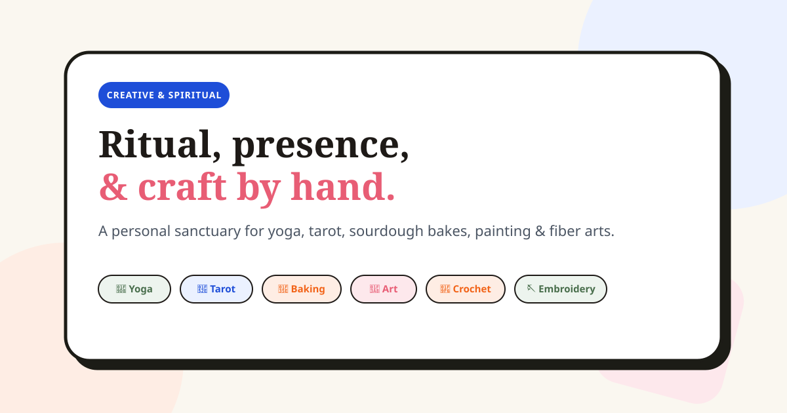
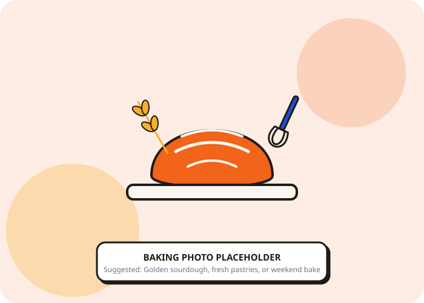
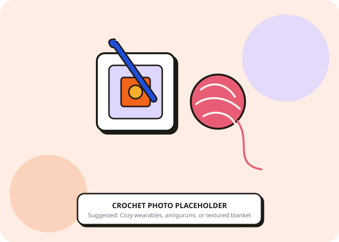
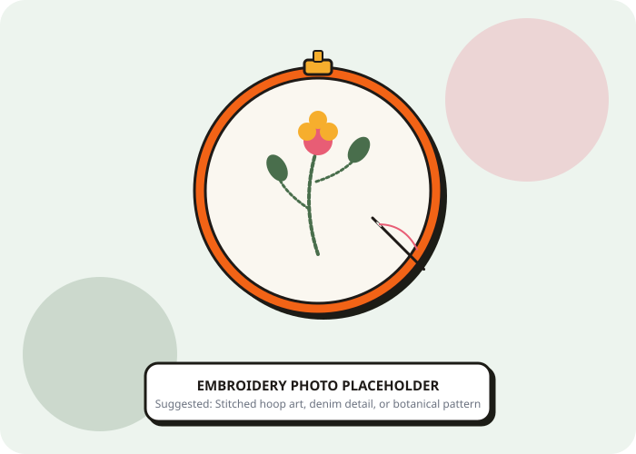
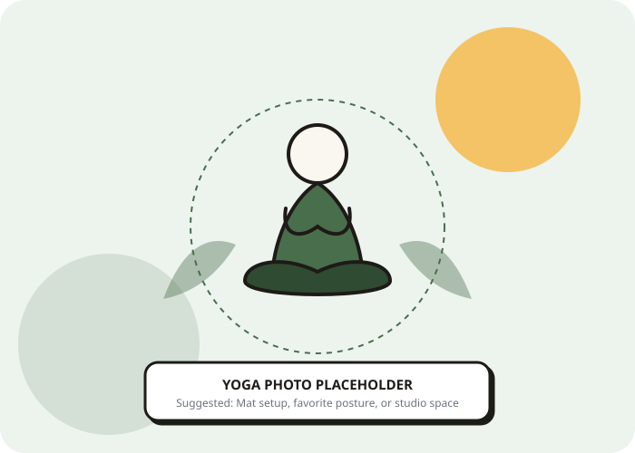

# Pradheepa Ramasundaram — Personal Website

An eclectic, colorful, single-page personal website celebrating creative and spiritual practices in this order: **books, baking, painting, tarot, chess, crochet and embroidery, and yoga**.

The site also includes an art portfolio and workshop offering through [The Kala Odyssey](https://pradheepar.wixsite.com/thekalaodyssey), a Goodreads profile, and a filterable Sparks section for smaller interests such as vibecoding, board games, mocktail making, origami, junk journaling, and shape stamping.

## 🎨 Site Images

The project includes handcrafted placeholder artwork used throughout the page:

| Practice | Preview |
| --- | --- |
| Books / reading mood |  |
| Baking |  |
| Painting |  |
| Tarot |  |
| Chess |  |
| Crochet |  |
| Embroidery |  |
| Yoga |  |

Replace these SVG placeholders with personal `.jpg`, `.png`, or `.webp` images in `public/images/` when ready.

---
## 📂 Project Structure

```text
/
├── index.html                  # Main single-page portfolio
├── package.json                # Tailwind CSS build scripts & dependencies
├── tailwind.config.js          # Design tokens (colors, typography, shadows, borders)
├── README.md                   # Setup, customization & deployment guide
├── src/
│   ├── styles/
│   │   └── main.css            # Tailwind directives, CSS variables & animations
│   └── scripts/
│       └── main.js             # Interactive widgets, 3D flipper, calculator, toast
├── public/
│   ├── audio/                  # Ambient Read With Me MP3 tracks
│   │   ├── fireplace.mp3
│   │   ├── rain.mp3
│   │   ├── clock-tick.mp3
│   │   ├── cat-purr.mp3
│   │   └── page-turns.mp3
│   └── images/                 # Illustrations and personal image placeholders
│       ├── hero-portrait-placeholder.svg
│       ├── yoga-placeholder.svg
│       ├── tarot-placeholder.svg
│       ├── tarot-card-reference.svg
│       ├── baking-placeholder.svg
│       ├── art-placeholder.svg
│       ├── chess-placeholder.svg
│       ├── reading-corner.svg
│       ├── crochet-placeholder.svg
│       ├── embroidery-placeholder.svg
│       └── og-image.svg
└── dist/
   └── styles.css              # Compiled production stylesheet
```

Ambient reading sounds are stored in `public/audio/` as `.mp3` files: fireplace, rain, clock tick, cat purr, and page turns.
---

## 🛠️ Local Development & Build

### 1. Install Dependencies
```bash
npm install
```

### 2. Start the local preview server
```bash
npm run dev
```
Then open `http://localhost:5173/`. Do not double-click `index.html`; serving the project over HTTP is required for reliable audio, fetch, and asset loading.

### 3. Build for Production
To create the minified production stylesheet:
```bash
npm run build
```

---

## 📸 Customizing Photos & Text

1. **Replace Placeholders**:
   Search for `<!-- TODO: replace with your own photo -->` in `index.html`. Swap out the placeholder paths in `src=""` with your own `.jpg`, `.png`, or `.webp` photos located in `public/images/`.
2. **Replace Stories & Anecdotes**:
   Search for `<!-- TODO: replace with your real story -->` in `index.html` to swap in your personal memories.
3. **Social Links**:
   Update `https://instagram.com`, `https://pinterest.com`, etc. with your exact usernames/URLs.

---

## 🚀 Deployment to GitHub Pages

1. Push this repository to GitHub.
2. In your GitHub repository:
   - Go to **Settings** &rarr; **Pages**.
   - Under **Build and deployment** &rarr; **Source**, select **Deploy from a branch**.
   - Choose the `main` branch and `/ (root)` folder.
   - Click **Save**.
3. Your site will be live at `https://<your-username>.github.io/<repo-name>/` in 1–2 minutes!


